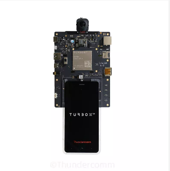

# Qualcomm® QCS610 SoC Open Kit DriverWarn-demo2 Developer documentation

## Introduce

This project relies on the QCS610 development kit, using the AI computing power and image processing capabilities of the development kit to collect images in real time, perform AI reasoning after preprocessing, and output the reasoning results. I use gstreamer and tflite (support NNAPI) to complete the above functions. The front camera collects facial images to detect the driver's fatigue state, and the rear camera is used to display road conditions outside the vehicle. 

The current deployment of deep learning is extremely hot, so I think it is necessary to deploy deep learning models in embedded devices. In life, fatigue driving causes a lot of traffic accidents, so I thought of this small project of driving warning.

The project was built in x86 host with across complier tool and has been tested in Qualcomm® QCS610 SoC device.

<center>Qualcomm® QCS610 SoC Development board</center>

<div align=center>

</div>


## Materials and Tools used for the project

1. Hardware materials

Except for the development board,The following hardware materials are also needed:

* Type-C usb line

using the usb line to develop on Qualcomm® QCS610 SoC development board.


* Charger

Direct power supply for Qualcomm® QCS610 SoC development board


* DP-Line

using the universal dp line to connect LED displayer to  Qualcomm® QCS610 SoC development board.


* LED-Displayer

using a LED Displayer to display the objectTracker-demo2 interface from Qualcomm® QCS610 SoC development board.


## Environment configuration

This section mainly describes the source and configuration of some open source projects or third-party tools needed in the development process.


### Tensorflow

1. Download Tensoflow source code(version > 2.0):
   [https://github.com/tensorflow/tensorflow](https://github.com/tensorflow/tensorflow)
2. build Tensorflow for support TFLite runtime in your QCS610 open kit.
3. Git clone this project link [https://github.com/ThunderSoft-XA/C610-DriverWarn-demo2/](https://github.com/ThunderSoft-XA/C610-DriverWarn-demo2/)
4. build the project after solve other dependencies 

```
If the system on your development kit already supports TFLite runtime, you can skip step 1  and step 2.
```


### OpenCV

The version of OpenCV is 3.4.3.There are many tutorials for opencv installation on the network.Therefore, you can completely refer to other people's installation methods for installation and configuration.For example:[https://www.cnblogs.com/uestc-mm/p/7338244.html](https://www.cnblogs.com/uestc-mm/p/7338244.html)

```
Notice:
This project uses the opencv native face detection model, so you need to download a haarcascade_frontalface_default.xml.
Or,You can go to your python3 directory to get it,as follow:
    xxx/xxx/python3.x/site-packages/cv2/data/haarcascade_frontalface_default.xml
```

## Compile

The compilation of the whole project is based on the yocto compilation tool, so you need to write some .bb and .conf files according to the specification. The link is [driver_warn_1.0.bb](https://github.com/ThunderSoft-XA/C610-DriverWarn-demo2/blob/master/C610-DriverWarn-demo2/driver_warn_1.0.bb) example.

Please refer to [the official Manual of Yocto](https://www.yoctoproject.org) for how to add layers,write layer.conf .Then,excute the command as follows:

```
bitbake DriverWarn
```

you will get a  executable bin file named gst_test.Move it to the root of the source code.Next,push the whole project code to Qualcomm® QCS610 SoC device`s dir /data/.

```
adb root && adb disable-verity && adb reboot

adb root &&adb remount && adb shell mount -o remount,rw /

adb push xxx/xxx/sourcepath /data/

adb shell

cd data/DriverWarn-demo2
```

## Configure and Usage

### 1. Configure

gstreamer pipeline config:
[conf_info]
| parameter| note |
| ---- | ---- | 
conf_count = 1   |  //parse configure total number in current file

[gst_0]
| parameter| note |
| ---- | ---- | 
gstid=0             |       //gstreamer pipeline  ID
gstname=gst_zero    |  //gstreamer pipeline name
sinkname=gst_sink  |  //gstreamer pipeline appsink Plug-in name
gsttype=1          |             // gstreamer pipeline type ,0 = rtsp ,1 = camera, 2 = local file |
enable=on |
path=1     |                        // gstreamer pipeline source sink path ,rtsp = url,camera=camera id,local file = local video file path
decode=h264  |              // gstreamer pipeline decode type
framerate=30 | 
format=NV12 |
width=640 | 
height=360 |
hw_dec=1     |                //gstreamer pipeline hardware decode or software decode
calibration=1  |             //image frame need calibration or not, 1 = need

AI model config:
[conf_info]
| parameter| note |
| ---- | ---- | 
conf_count=3      |      //parse configure total number in current file

[ai_thread_0]
| parameter| note |
| ---- | ---- | 
ai_id=0 |
ai_name=face_landmark  |
data_source=gst_zero        |           //AI inference data from anywhere gstreamer pipeline
model_path=./../models/face_landmark.tflite  | 
input_width=192   | 
input_height=192  | 
channel=3   | 
delegate=1                     |                     //use tflite runtime delegate,0 = CPU,1 = NNAPI, 2 = GPU,3 = DSP
input_mean=127.5    |                     //model mean value for Calculation output 
std_mean=127.5           |                  //model mean value for Calculation output range 
input_layer_type=uint_8  | 
max_profiling_buffer_entries=1024  |  //Not implemented yet 
number_of_warmup_runs=2  |   //Not implemented yet 

### 2. Usage

This project only provides a simple command line interface.

Run DriverWarn(This is the project name, the actual executable file name is gst_test, which can be modified in the CMakeListe.txt file in the root directory of the project )：

Run the **DriverWarn** test demo.This test demo has only command line output.

```
$ cd /data/<source root dir> && mkdir build
$ cp gst_test ./build && cd build
$ ./weston_dp_cmd gst_test

Notice:
DP display uses weston graphical interface support, so I provide weston_dp_cmd script in the project root directory 

```
